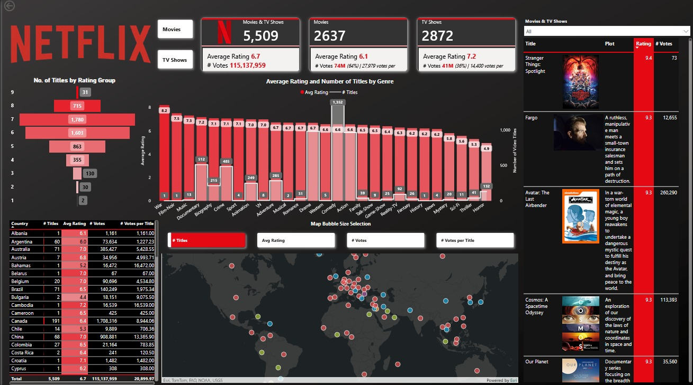

# 🎬 Netflix Content Analytics Dashboard

🎬 Project Overview

This project analyzes a comprehensive Netflix dataset to uncover content distribution trends, rating patterns, genre popularity, and global production insights. The dashboard was engineered to provide an interactive exploration of content performance, allowing for a granular look at how quality (ratings) relates to quantity (titles).
🛠 Tools & Technologies

    Power BI: Core visualization and dashboard design.

    DAX (Data Analysis Expressions): Used for calculated measures such as Average Rating and Votes per Title.

    Power Query: Data transformation, cleaning, and normalization.

    Data Modeling: Establishing relationships between genre, country, and title datasets.

    Exploratory Data Analysis (EDA): Identifying trends and outliers in viewer engagement.

🎯 Business Objectives

    Content Segmentation: Analyze the split between Movies and TV Shows (2,637 vs. 2,872 titles).

    Genre Performance: Identify which genres dominate the library versus which ones achieve the highest user satisfaction.

    Quality Benchmarking: Evaluate average ratings across different content categories.

    Geographic Analysis: Study production concentration and performance across 20+ countries.

    Engagement Metrics: Examine the correlation between vote counts and overall rating distribution.

📊 Key Insights

    Content Volume: Contrary to general trends, this dataset shows TV Shows (2,872) slightly outnumbering Movies (2,637).

    Quality vs. Quantity: While Drama and Comedy have the highest content volume, niche genres like War and Film-Noir maintain higher average ratings (8.2 and 7.5 respectively).

    Platform Performance: TV Shows hold a significantly higher average rating (7.2) compared to Movies (6.1).

    Global Leaders: Canada and Brazil show strong production numbers, with Canada contributing 191 titles with a massive 1.7M+ total votes.

    Rating Sweet Spot: The majority of Netflix content is clustered in the 6.0 to 8.0 rating range, with a sharp drop-off for titles rated above 9.0.

📁 Files Included

    Power BI Dashboard Screenshots: High-resolution captures of the interactive UI. [Download Netflix-Dashboard](images/Netflix_Dashboard.jpeg)

    Technical Documentation (DOCX): Comprehensive breakdown of data sources, DAX formulas, and methodology. [Download Documentation](documentation/uber-project-documentation.docx)
    
    Power BI Dashboard File (.pbix): [Download Netflix-Dashboard- powerBi](files/Netflix.pbix)

## 📌 Dashboard Preview

