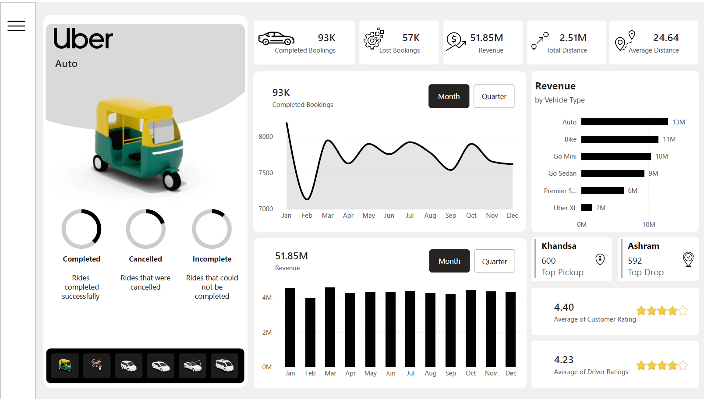

# 🚖 Uber Operations Analytics Dashboard

## 📌 Project Overview
This project analyzes Uber ride operations data to evaluate booking performance, revenue generation, customer behavior, cancellation trends, and operational mobility patterns.  

The dashboard provides actionable insights to support operational efficiency and demand forecasting.

---

## 🛠 Tools & Technologies
- Power BI
- DAX (Data Analysis Expressions)
- Power Query
- Data Modeling
- Data Visualization

---

## 📊 Executive Summary

### 💰 Financial Performance
- Total Revenue: **$51.85M**
- Completed Bookings: **93K**
- Lost Bookings: **57K**
- Total Distance Covered: **2.51M**
- Average Trip Distance: **24.64**
- Average Customer Rating: **4.40**
- Average Driver Rating: **4.23**

Despite strong revenue generation, a significant number of lost bookings indicates an opportunity for operational improvement.

---

## 🚘 Revenue & Vehicle Performance

Revenue is diversified across vehicle categories, with **Auto and Bike** contributing the highest share.

| Vehicle Type | Completed Bookings | Revenue ($) |
|--------------|-------------------|-------------|
| Auto | 23,128 | 12.87M |
| Bike | 20,560 | 11.45M |
| Go Mini | 18,529 | 10.33M |
| Go Sedan | 16,666 | 9.36M |
| Premier Sedan | 11,247 | 6.27M |
| Uber XL | 2,783 | 1.52M |

Autos and Bikes also covered the highest travel distance.

---

## 💳 Payment Insights

Customers strongly prefer digital payment methods:

- **UPI**: 21M (most preferred)
- Cash: 12M
- Uber Wallet: 6M
- Credit Card: 5M
- Debit Card: 4M

This highlights high digital adoption among riders.

---

## 👥 Customer Insights

- Total Active Customers: **104K**
- First-Time Riders: **48K**
- Regular Riders: **11K**
- Returned Riders: **5,650**

The platform shows strong new user acquisition but potential to improve rider retention.

---

## ❌ Cancellation Analysis

Top reasons for lost bookings:

- Customer-related issues: 6,835
- Personal & vehicle issues: 6,724
- Capacity issues: 6,684
- Health-related concerns: 6,751

Cancellation trends indicate operational bottlenecks and rider behavior impact completion rates.

---

## 📍 Operational Mobility Insights

### 🚏 Top Pickup Locations
1. Khandsa – 949 bookings  
2. Barakhamba Road – 946 bookings  
3. Saket – 931 bookings  
4. Badarpur – 921 bookings  
5. Pragati Maidan – 920 bookings  

### ⏰ Peak Demand Periods
- Highest demand: **6 PM – 9 PM**
- Tuesday peak: **4,798 bookings**
- Afternoon (3 PM – 6 PM) also consistently high
- Lowest demand: **12 AM – 6 AM**

Evening commute drives the majority of bookings.

---

## 📊 Dashboard Preview

---

## 📄 Project Files

- 📑 Full Dashboard Report (PDF):  
  [Download Report](reports/Uber.pdf)

- 📘 Detailed Project Documentation (Word File):  
  [Download Documentation](documentation/uber-project-documentation.docx)

---

## 📚 Dataset & Learning Resources
- Dataset Source: YouTube Video Description  
- YouTube Channel Referred: The Developer

---

## 🎯 Key Business Takeaways

- Strong revenue generation with room to reduce booking losses.
- Evening commute drives peak operational load.
- Digital payment dominance indicates fintech adoption.
- Cancellation analysis reveals optimization opportunities.
- Vehicle type segmentation helps allocate fleet resources efficiently.
